# Building A Restaurant With Boostrap.

A responsive website for a restaurant where users can read restaurant detials and place orders.

## Features

	- Modern Bootstrap styling
	- Uses JS to handle events

## Installation

	- Clone and pull source code from provided github repository
	- Run html files on desired browser

## Code

	https://github.com/nicholas-auyeung/Building-A-Restaurant-Website-With-Boostrap

## Flow

1. Open Visual Studio Code.

2. Create project folder.

3. Create resources contained with css and javascript subdirectories.

4. Create index.html page.

5. Add bootstrap cdn links.

6. Add and define bootstrap navbar.

7. Add bootstrap image carousel.

8. Add bootstrap card grid for 'Our Favorites' content.

9. Add footer.

10. Add image src links.

11. Create styles.css inside resources/css/ and set class css attributes.

13. Create menu.html page.

14. Add bootstrap cdn links.

15. Copy already created navbar and footer.

16. Add bootstrap nav-pill for menu.

17. Add nav-pill-content and place singular vertical card grid inside.

18. Add imgage src links.

19. Add css attributes in styles.css.

20. Create locations.html page.

21. Copy already created navbar and footer.

22. Add card for location and define get directions button inside card content.

23. Add css attributes in styles.css.

24. Create contact.html page.

25. Add bootstrap cdn links.

26. Copy already created navbar and footer.

27. Add boostrap card for contact form

28. Create ordernow.html page

29. Copy All of menu.html

30. Add number input text fields in each menu card item.

31. Create contact.js in resources/js/.

32. Create and define collectcontactdata() function to collect contact form data and store data inside a contact JSON object.

33. Link collectcontactdata() event to submit button on contact form in contact.html.

34. Add JS src script to the end of file below body.

35. Create ordernow.js in resources/js/.

36. Create and define collectorderdata() function to collect order data and store inside an order JSON object.

37. Link collectorderdata() event to checkout button in ordernow.html.

38. Add JS src script to the end of file below body.

## Usage
Once downloaded or cloned, open index.html in desired web browser.
	
	The home page will be displayed with an image carasoul, and restaurant favorites.
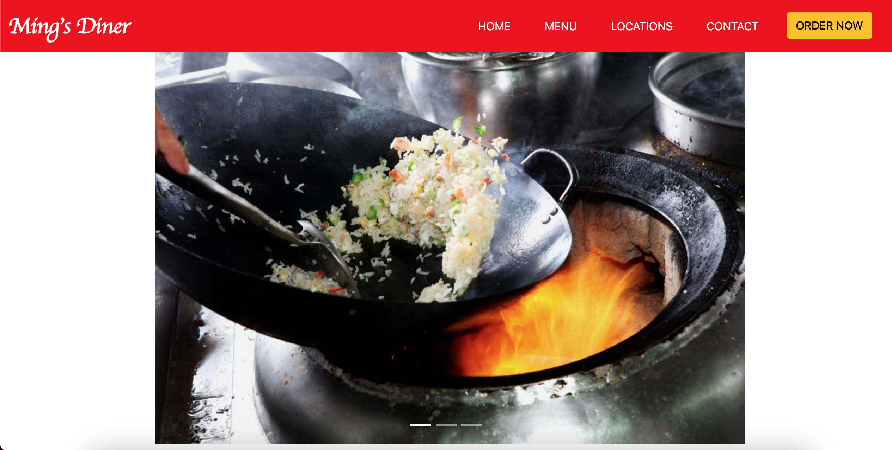
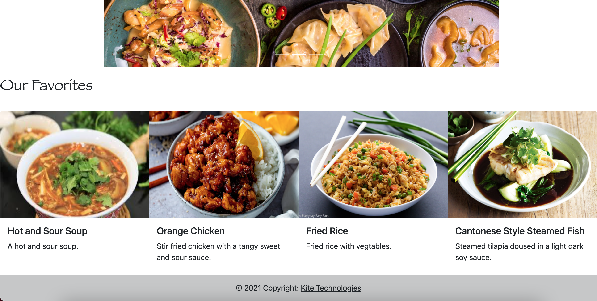

	Click the 'Menu' link on the navigation bar to view the menu.
	The menu displays different course categories that the user can tab through.
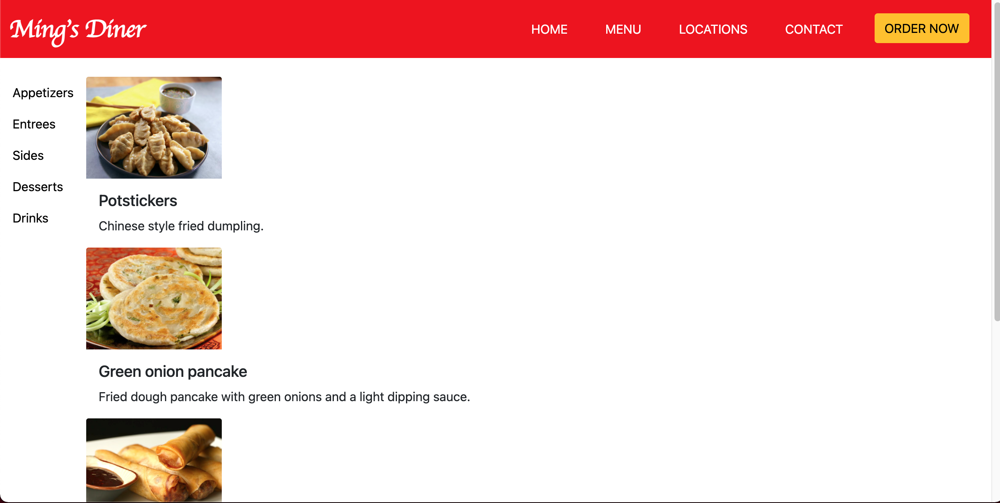
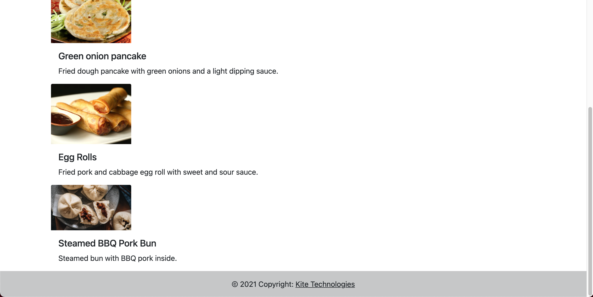
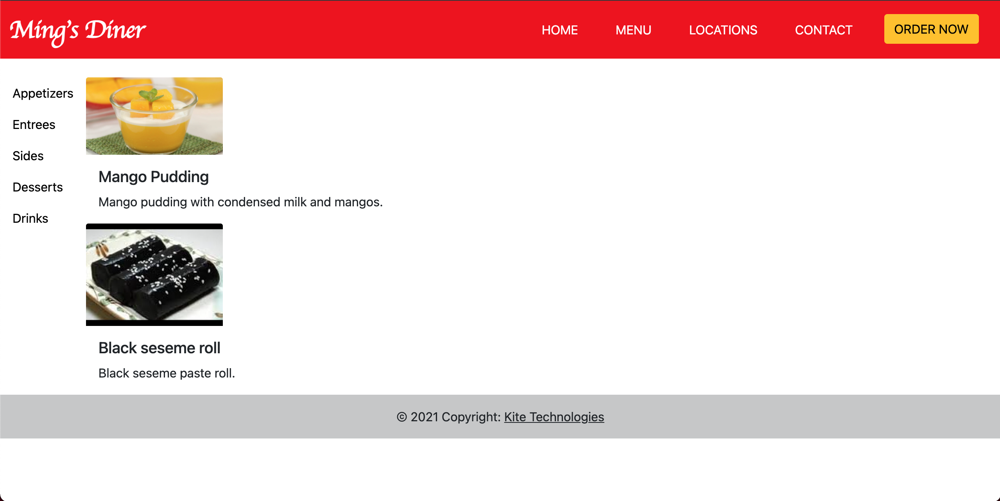
	
	Click the 'Locations' link on the navigation bar to view locations.
	A card containing restaurant location with a 'get directions' button.
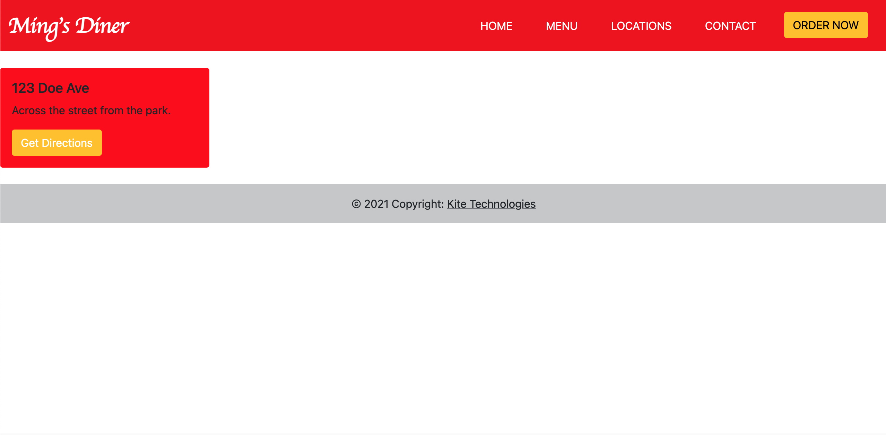

	Click the 'Contact' link on the navigation bar to view the contact form.
	A card form displaying name, email, and message fields.
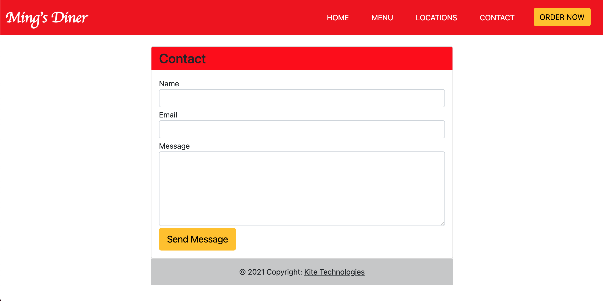

	Once user hits the 'Send Message' button a contact JSON object can be viewed in the console.
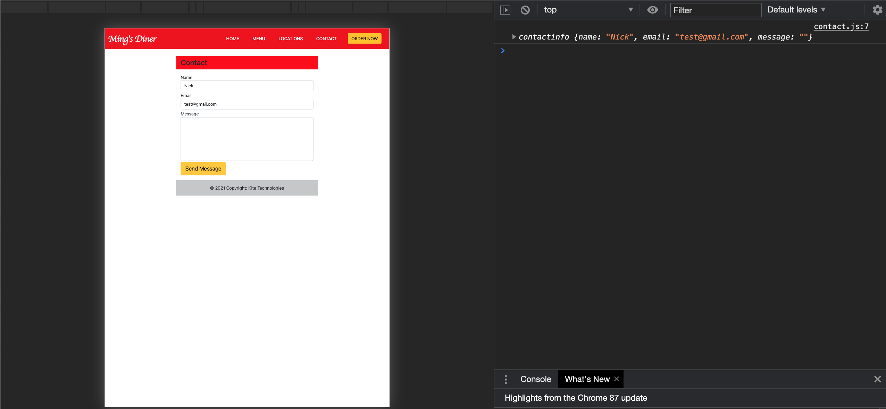

	Click the 'ORDER NOW' button to view the order page.
	The order page displays the same layout as the menu page but allows the user to add amounts of different items and after click the 'Checkout' button to checkout.

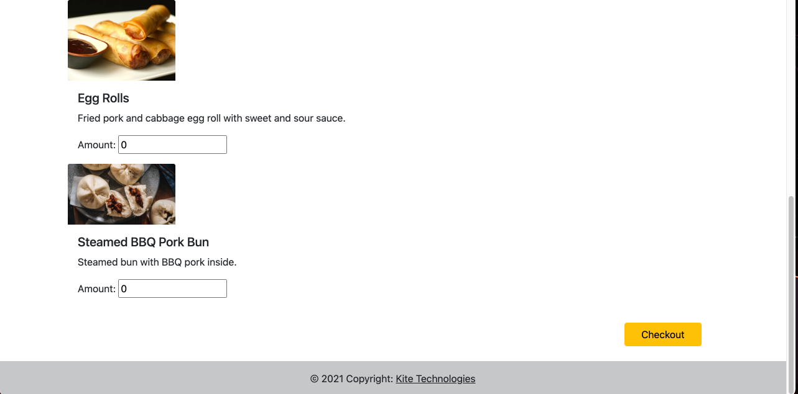
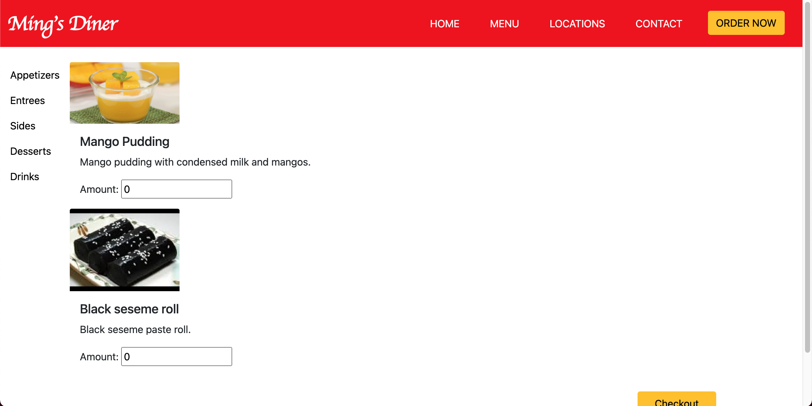

	Once user hits the 'Checkout' button an order JSON object can bew viewed in the console.
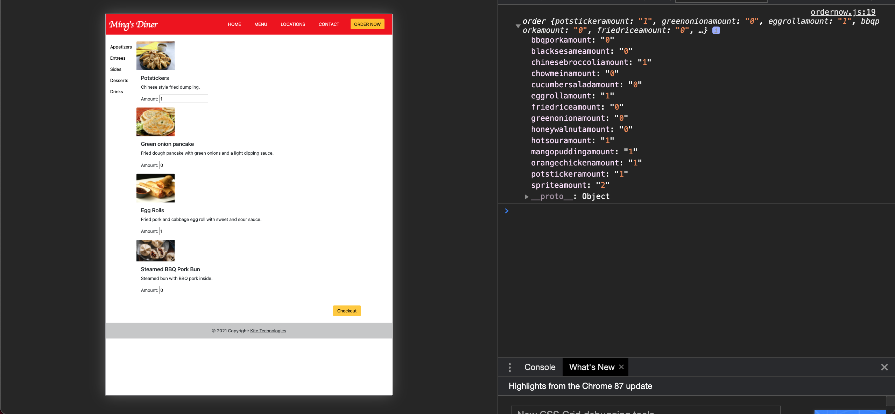

